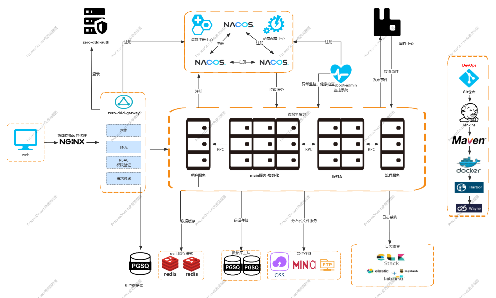

# 项目架构

### 项目简介

* 支持多租户架构，基于jpa搭建SAAS系统，支持Column, Schema, Database, Mixed架构。
* 支持DDD CQRS架构基础层代码落地。
* 提供RBAC和ABAC权限架构。
* 后端采用Spring Boot、Spring Cloud & Alibaba。

### 系统模块

<pre><code>zero-ddd
├── zero-business
│       └── zero-main-business
<strong>├── zero-ddd-ai
</strong>├── zero-ddd-auth      // 认证模块 [8080]
├── zero-ddd-component
│       └── zero-ddd-autoconfigure-component
│       └── zero-ddd-bean-component
│       └── zero-ddd-component-bom
│       └── zero-ddd-core-component
│       └── zero-ddd-doc-component
│       └── zero-ddd-domain-component
│       └── zero-ddd-excel-component
│       └── zero-ddd-graphql-component
│       └── zero-ddd-i18n-component
│       └── zero-ddd-json-component
│       └── zero-ddd-message-queue-component
│       └── zero-ddd-security-component
│       └── zero-ddd-storage-component
│       └── zero-ddd-tenant-component
├── zero-ddd-exchange  // 接口模块
├── zero-ddd-gateway   // 网关模块 [8080]
├── zero-ddd-tenant    // 网关模块 [8080]
</code></pre>

### 架构图

<figure><figcaption></figcaption></figure>

### 多模块代码架构

### 单模块代码架构

